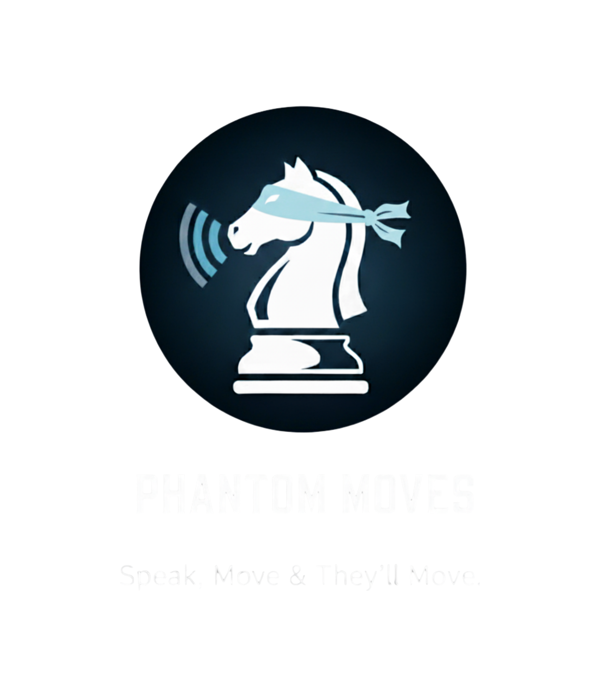

# 🎙️ Phantom Moves - Voice-Controlled Blind Chess



> **An innovative accessibility-focused chess application that enables players to play chess entirely through voice commands, designed specifically for blind and visually impaired users.**

[](https://opensource.org/licenses/MIT)
[](https://nodejs.org/)
[](https://expressjs.com/)

---

## 📋 Table of Contents

- [Overview](#-overview)
- [Key Features](#-key-features)
- [Demo](#-demo)
- [Technologies Used](#️-technologies-used)
- [Project Structure](#-project-structure)
- [Installation & Setup](#-installation--setup)
- [Voice Commands](#-voice-commands)
- [How to Play](#-how-to-play)
- [Browser Compatibility](#-browser-compatibility)
- [Motivation & Impact](#-motivation--impact)
- [Contributing](#-contributing)
- [License](#-license)
- [Contact](#-contact)

---

## 📋 Overview

**Phantom Moves** is a groundbreaking web application that makes chess truly accessible to everyone by eliminating visual dependency entirely. Using the Web Speech API, players can make moves, hear game updates, and enjoy a complete chess experience through voice alone.

### Why Phantom Moves?

Traditional digital chess platforms rely heavily on visual interaction, creating barriers for blind and visually impaired players. Phantom Moves removes these barriers by providing:

- 🎤 **Complete voice control** - No mouse or screen needed
- 🔊 **Real-time audio feedback** - Every move is announced
- ♿ **Universal accessibility** - Play chess independently
- 🌍 **Web-based** - No installation required

---

## ✨ Key Features

### Core Functionality
- ✅ **100% Voice-Controlled Interface** - Play chess using natural voice commands
- ✅ **Intelligent Text-to-Speech** - Clear audio feedback for every move and game state
- ✅ **Complete Chess Rules** - Full support for castling, en passant, promotion, check, and checkmate
- ✅ **Move History Audio** - Listen to all previous moves on demand
- ✅ **Draw & Resign Options** - Voice commands for game conclusion
- ✅ **Undo Functionality** - Take back moves with voice commands

### User Experience
- 🎨 **Clean, Minimal Interface** - Visual board for sighted spectators and assistants
- ⌨️ **Keyboard Shortcuts** - Press 'V' to activate voice recognition
- 📱 **Responsive Design** - Works seamlessly on desktop, tablet, and mobile
- 🔄 **Continuous Listening Mode** - Automatic reactivation for smooth gameplay

### Accessibility
- ♿ **WCAG Compliant** - Designed with accessibility standards in mind
- 🌐 **Browser-Based** - No special software installation required
- 🔒 **Privacy-First** - All voice processing happens locally in the browser

---

## 🎥 Demo

[//]: # (Add demo video or GIF here)

**Try it yourself:**
1. Clone the repository
2. Run `npm install && npm start`
3. Navigate to `http://localhost:3000`
4. Allow microphone access
5. Start playing with voice commands!

---

## 🛠️ Technologies Used

### Backend
- **Node.js** - JavaScript runtime environment
- **Express.js** - Web application framework
- **Path** - File path utilities

### Frontend
- **Vanilla JavaScript (ES6+)** - Core application logic
- **Chess.js** - Complete chess move validation and game logic
- **Chessground** - Beautiful, responsive chess board UI
- **Web Speech API (SpeechRecognition)** - Voice command recognition
- **Web Speech API (SpeechSynthesis)** - Text-to-speech output

### Styling
- **CSS3** - Custom styling with responsive design
- **Chessground CSS** - Pre-styled chess board themes

---

## 📁 Project Structure

```
Phantom-Moves/
│
├── node_modules/          # Dependencies
│   ├── chess.js/          # Chess logic library
│   ├── chessground/       # Chess board UI library
│   ├── express/           # Web server framework
│   └── ...                # Other dependencies
│
├── public/                # Static files served to client
│   ├── index.html         # Main HTML structure
│   ├── script.js          # Client-side JavaScript logic
│   ├── styles.css         # Custom CSS styling
│   ├── chessground.css    # Chessground base styles
│   ├── chessgroundbase.css   # Chessground theme base
│   ├── chessgroundbrown.css  # Brown chess board theme
│   └── phantom-moves.png      # Application logo
│
├── server.js              # Express server configuration
├── package.json           # Project dependencies and scripts
├── package-lock.json      # Locked dependency versions
└── README.md              # Project documentation (this file)
```

---

## 🚀 Installation & Setup

### Prerequisites

Before you begin, ensure you have the following installed:
- **Node.js** (v14.0.0 or higher) - [Download here](https://nodejs.org/)
- **npm** (comes with Node.js)
- A modern web browser (Chrome, Edge, or Safari recommended)
- A working microphone

### Step-by-Step Installation

1. **Clone the repository**
   ```bash
   git clone https://github.com/sebas80sebas/Phantom-Moves.git
   cd Phantom-Moves
   ```

2. **Install dependencies**
   ```bash
   npm install
   ```

3. **Start the server**
   ```bash
   npm start
   ```
   Or alternatively:
   ```bash
   node server.js
   ```

4. **Open in browser**
   ```
   Navigate to: http://localhost:3000
   ```

5. **Allow microphone access**
   - Your browser will prompt you to allow microphone access
   - Click "Allow" to enable voice commands

6. **Start playing!**
   - Click the "Start Game" button
   - Click "Speak" or press 'V' to begin using voice commands

### Troubleshooting

**Port already in use?**
```bash
# Kill process on port 3000
lsof -ti:3000 | xargs kill -9

# Or change the port in server.js
const PORT = 3001; // Change to any available port
```

**Microphone not working?**
- Ensure your browser has microphone permissions
- Check system microphone settings
- Try reloading the page
- Use Chrome or Edge for best compatibility

---

## 🎮 Voice Commands

### Basic Moves

| Command | Example | Description |
|---------|---------|-------------|
| `move [piece] to [square]` | "move knight to e4" | Move a specific piece |
| `[piece] takes [square]` | "queen takes d5" | Capture with a piece |
| `[piece] [square]` | "pawn e4" | Short form (moves piece to square) |

### Piece Names
- **Pawn** - "pawn"
- **Knight** - "knight"
- **Bishop** - "bishop"
- **Rook** - "rook"
- **Queen** - "queen"
- **King** - "king"

### Special Moves

| Command | Description |
|---------|-------------|
| `castle kingside` | Perform O-O (short castling) |
| `castle queenside` | Perform O-O-O (long castling) |

### Game Actions

| Command | Description |
|---------|-------------|
| `draw` | Offer a draw to opponent |
| `resign` | Resign from the current game |
| `read` | Listen to all moves made in the game |
| `undo` | Undo the last move |

### Keyboard Shortcuts

| Key | Action |
|-----|--------|
| `V` | Activate/deactivate voice recognition |

---

## 🎯 How to Play

### Starting a Game

1. **Launch the application**
   - Open `http://localhost:3000` in your browser

2. **Welcome screen**
   - You'll see the Phantom Moves welcome screen
   - Click "Start Game" button

3. **Board setup**
   - The chess board appears with pieces in starting position
   - White plays first

### Making Moves

1. **Activate voice recognition**
   - Click the "Speak" button
   - Or press the 'V' key on your keyboard
   - The button will show "Listening..."

2. **Speak your move clearly**
   - Example: "move pawn to e4"
   - Example: "knight takes f6"
   - Speak at a normal pace and volume

3. **Hear the confirmation**
   - The game will announce: "Player 1 made the move e4"
   - The board updates automatically
   - Voice recognition reactivates for the next move

4. **Continue playing**
   - Alternate between players
   - Each move is announced audibly
   - Game states (check, checkmate) are announced

### Game Flow

```
Start Game → Speak Button → Make Move → Hear Feedback → Next Turn
     ↑                                                        ↓
     └────────────────────── Continue Playing ───────────────┘
```

### Special Situations

**Check:**
- Audio announces: "Player X made Check"
- King must move to safety

**Checkmate:**
- Audio announces: "Player X made Checkmate"
- Game ends, winner declared

**Draw:**
- Say "draw" to offer
- Opponent must accept or reject via modal

**Resignation:**
- Say "resign" to forfeit
- Confirmation modal appears

---

## 🌐 Browser Compatibility

### Recommended Browsers

| Browser | Voice Recognition | Text-to-Speech | Status |
|---------|------------------|----------------|--------|
| **Google Chrome** | ✅ Excellent | ✅ Excellent | **Recommended** |
| **Microsoft Edge** | ✅ Excellent | ✅ Excellent | **Recommended** |
| **Safari** | ✅ Good | ✅ Good | Supported |
| **Firefox** | ⚠️ Limited | ✅ Good | Partial Support |
| **Opera** | ✅ Good | ✅ Good | Supported |

### Requirements
- **Web Speech API** support (SpeechRecognition)
- **SpeechSynthesis** support
- **Microphone access**
- **JavaScript enabled**

### Testing Your Browser

Visit this page to check compatibility:
```
https://developer.mozilla.org/en-US/docs/Web/API/Web_Speech_API#browser_compatibility
```

---

## 🌟 Motivation & Impact

### The Problem

Chess is a universal game enjoyed by millions worldwide, but traditional digital chess platforms create significant barriers for blind and visually impaired players:

- ❌ Heavy reliance on visual board interaction
- ❌ Inaccessible mouse-based controls
- ❌ Lack of comprehensive audio feedback
- ❌ Screen readers provide incomplete information

### Our Solution

**Phantom Moves eliminates these barriers** by providing:

- ✅ **Complete independence** - No visual or physical assistance needed
- ✅ **Natural interaction** - Play using everyday language
- ✅ **Equal opportunity** - Same chess experience for all players
- ✅ **Cognitive accessibility** - Clear, structured audio feedback

### Real-World Impact

- 🌍 **2.2 billion people** worldwide have vision impairment (WHO)
- ♟️ Chess develops **critical thinking, strategy, and problem-solving**
- 🎓 Educational tool for **blind students** learning chess
- 🤝 Enables **inclusive tournaments** and social play
- 💡 Demonstrates potential of **voice-first interfaces**

### Accessibility Principles

Phantom Moves follows these core principles:

1. **Perceivable** - Information communicated through audio
2. **Operable** - Fully controllable via voice
3. **Understandable** - Clear, consistent audio feedback
4. **Robust** - Works across modern browsers and devices

---

## 🏆 Hackathon Submission

This project was developed to demonstrate the power of **accessible design** and **inclusive technology** in gaming.

### Innovation Highlights

🔹 **Novel Approach** - First fully voice-controlled web chess application  
🔹 **Zero Dependencies on Vision** - Complete audio-only experience  
🔹 **Natural Language Processing** - Intuitive move command interpretation  
🔹 **Real-Time Feedback** - Immediate audio confirmation system  
🔹 **Browser-Native** - No installation, no platform restrictions  
🔹 **Open Source** - Available for community improvement and adaptation  

### Technical Achievements

- ✅ Seamless Web Speech API integration
- ✅ Robust chess move validation and parsing
- ✅ State management for blind users
- ✅ Responsive, mobile-friendly design
- ✅ Error handling with voice feedback

---

## 🤝 Contributing

We welcome contributions from the community! Whether you're fixing bugs, adding features, or improving documentation, your help is appreciated.

### How to Contribute

1. **Fork the repository**
   ```bash
   git clone https://github.com/sebas80sebas/Phantom-Moves.git
   ```

2. **Create a feature branch**
   ```bash
   git checkout -b feature/amazing-feature
   ```

3. **Make your changes**
   - Write clean, commented code
   - Follow existing code style
   - Test thoroughly

4. **Commit your changes**
   ```bash
   git commit -m 'Add some amazing feature'
   ```

5. **Push to the branch**
   ```bash
   git push origin feature/amazing-feature
   ```

6. **Open a Pull Request**

### Contribution Ideas

- 🌐 Add multi-language support (Spanish, French, German, etc.)
- 🎨 Create additional board themes
- 🤖 Implement AI opponent using Stockfish
- 📊 Add game statistics and analysis
- 🔊 Improve voice recognition accuracy
- 📱 Optimize mobile experience
- ♿ Enhance accessibility features
- 📚 Add interactive tutorial mode

---

## 📝 License

This project is licensed under the **MIT License** - see the [LICENSE](LICENSE) file for details.

```
MIT License

Copyright (c) 2025-2026 — Iván Sebastián Loor Weir

Permission is hereby granted, free of charge, to any person obtaining a copy of this software and associated documentation files (the "Software"), to deal in the Software without restriction, including without limitation the rights to use, copy, modify, merge, publish, distribute, sublicense, and/or sell copies of the Software, and to permit persons to whom the Software is furnished to do so, subject to the following conditions:

The above copyright notice and this permission notice shall be included in all copies or substantial portions of the Software.

THE SOFTWARE IS PROVIDED "AS IS", WITHOUT WARRANTY OF ANY KIND, EXPRESS OR IMPLIED, INCLUDING BUT NOT LIMITED TO THE WARRANTIES OF MERCHANTABILITY, FITNESS FOR A PARTICULAR PURPOSE AND NONINFRINGEMENT. IN NO EVENT SHALL THE AUTHORS OR COPYRIGHT HOLDERS BE LIABLE FOR ANY CLAIM, DAMAGES OR OTHER LIABILITY, WHETHER IN AN ACTION OF CONTRACT, TORT OR OTHERWISE, ARISING FROM, OUT OF OR IN CONNECTION WITH THE SOFTWARE OR THE USE OR OTHER DEALINGS IN THE SOFTWARE.
```

---

## 👏 Acknowledgments

- **[Chess.js](https://github.com/jhlywa/chess.js)** - Robust chess move validation and game logic
- **[Chessground](https://github.com/lichess-org/chessground)** - Beautiful, responsive chess board UI
- **[Web Speech API](https://developer.mozilla.org/en-US/docs/Web/API/Web_Speech_API)** - Browser voice recognition and synthesis
- **[Express.js](https://expressjs.com/)** - Fast, minimalist web framework
- The **blind and visually impaired community** for inspiration and user feedback
- Open source contributors worldwide

---

## 📧 Contact

**Project Creator:** Iván Sebastián Loor Weir

- 📧 Email: [sebas80sebas@gmail.com]
- 🐙 GitHub: [@sebas80sebas](https://github.com/sebas80sebas)
- 🔗 LinkedIn: [My LinkedIn](https://www.linkedin.com/in/iv%C3%A1n-sebasti%C3%A1n-loor-weir-386305271)

**Project Repository:** [https://github.com/sebas80sebas/Phantom-Moves](https://github.com/sebas80sebas/Phantom-Moves)

**Phantom Moves** - Making chess accessible to everyone, one move at a time.
